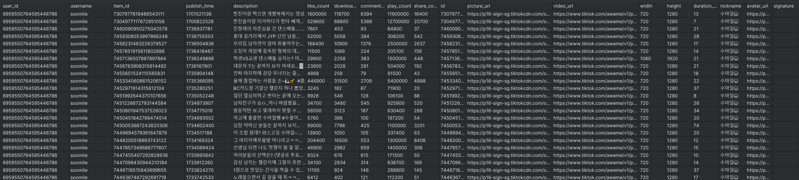

# SaveMyTikTok
## About This Project
This project is a third-party automated TikTok data collection tool, built on the TikTok-Api framework. It allows users to save both personal and public TikTok videos without requiring login credentials, ensuring continued access to content even if TikTok is restricted in your region.

thanks https://github.com/davidteather/TikTok-Api

# Key Features
**No login required** – Seamlessly migrate and back up TikTok videos.

**Save any video** – Download your own **Watermark-free** videos or content from other users.

**Export support** – Easily export video data for further use.

# Installation & Usage
Ensure **Python 3.8+** is installed before running the following commands:
```commandline
# Install dependencies  
pip install -r requirements.txt  

# Install Playwright  
python -m playwright install  

# Run the script  
python main.py --url https://www.tiktok.com/@soomile --output test.csv --count 10  

```
## Example Output



# Support & Contributions

If you find this project helpful, consider giving it a ⭐ on GitHub!

For any questions or issues, feel free to open an issue or reach out via the following channels:

```commandline
📧 Email: yuijks8@gmail.com
📢 Telegram: t.me/worldVarspeace
💼 Upwork: View Profile
```

# Acknowledgements

This project leverages the technical foundation provided by the [TikTok-Api](https://github.com/davidteather/TikTok-Api) repository. We would like to express our gratitude to the contributors for their invaluable work, which has made this project possible.